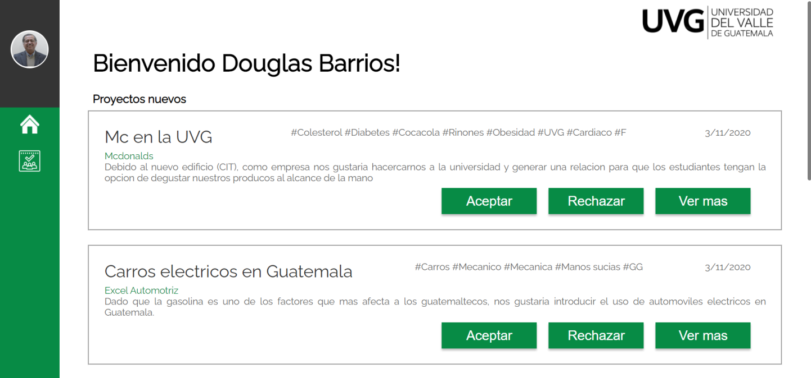
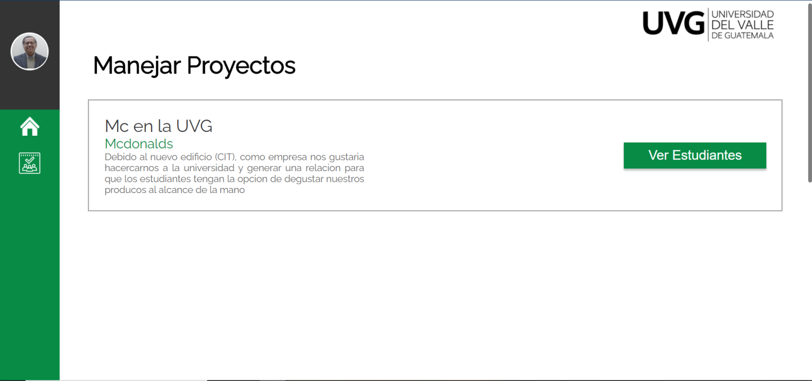
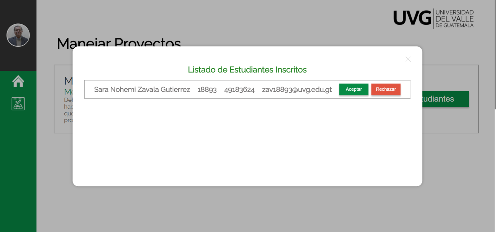
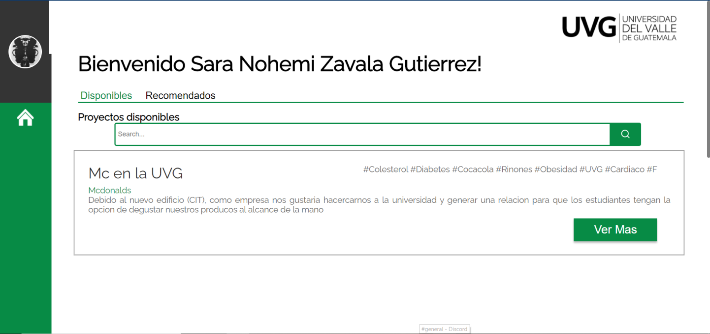
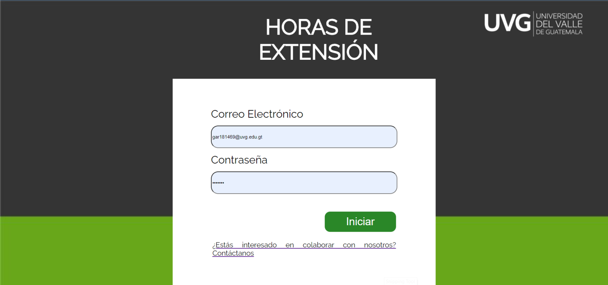

# Voluntariado-ReactApp

 Project made for Software Engineering 2 course.

<h2>Tecnologies and Languages used </h2>
<ul>
  <li> React-Redux </li>
  <li> Javascript </li>
  <li> CSS3 </li>
</ul>

 All libraries had beeing installed by Yarn, see its documentation for more information: <a href="https://classic.yarnpkg.com/en/docs/cli/create/"> Yarn </a>
 

<h2>Previews (some of them) </h2>
<h3>Admin User (Major principal) </h3>

<h3> User (Students) </h3>

<h3> Current Log in view </h3>

There are a few more "pages" / components that are not shown in this preview 

